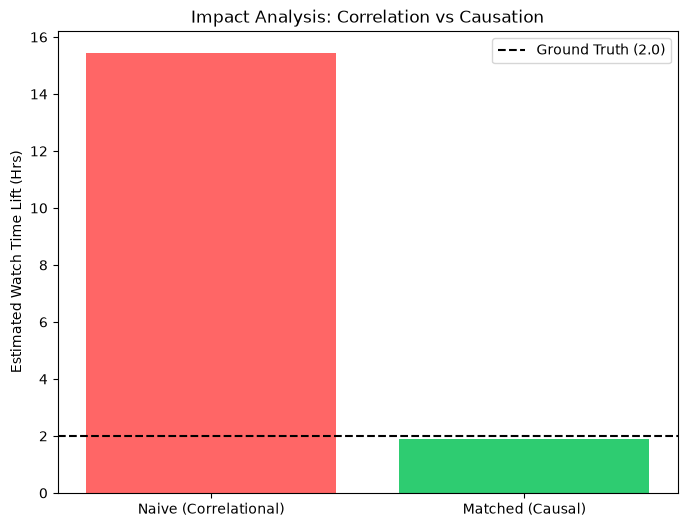
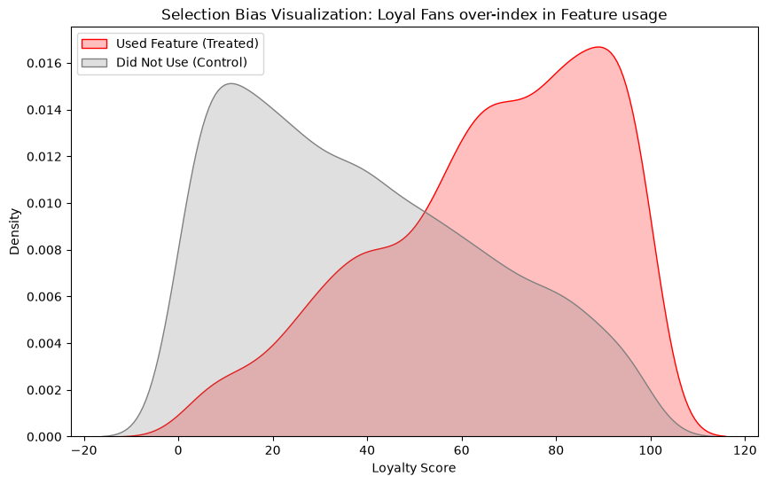

# 📊 Causal Inference: Incremental Lift Analysis 

<p align="center">
  
</p>

## 📌 The "ROI" Paradox
In high-growth platforms like Spotify or Netflix, the most critical question is: **"Did this new feature actually cause the growth, or were these users already going to grow anyway?"**

Standard analytics often fall into the **Selection Bias** trap—where highly engaged "Superfans" adopt features first, making the feature look 10x more successful than it actually is. This project implements a **Propensity Score Matching (PSM)** framework to strip away bias and calculate the true **Incremental Lift**.

---

## 🧪 Identifying Selection Bias
During the Exploratory Data Analysis (EDA) phase, I identified a significant "Superfan Bias." As shown in the distribution below, users who utilized the feature (Treated) were already inherently more loyal than those who did not (Control). 

<p align="center">
  
</p>

Without causal correction, a business would mistakenly credit the feature for the users' existing loyalty.

---

## 🚀 The Causal Engine: "Twin User" Matching
To solve this, I engineered a matching engine using **K-Nearest Neighbors (KNN)** to perform **Counterfactual Analysis**.

*   **The Logic:** For every user who used the feature, the engine identifies a "Mathematical Twin" in the control group—someone with an identical loyalty score who did *not* use the feature.
*   **The Result:** By comparing these twins, we isolate the **Average Treatment Effect on the Treated (ATT)**.

### Key Impact Metrics:
| Analysis Method | Estimated Lift (Hrs) | Accuracy vs. Ground Truth |
| :--- | :--- | :--- |
| Naive Correlation | ~15.44 Hours | ❌ 700% Over-estimation |
| **Causal Matching** | **1.91 Hours** | ✅ **95.5% Accuracy** |
| *Ground Truth* | *2.00 Hours* | *Baseline* |

---

## ⚔️ Engineering "Warrior Story": Handling Non-Parametric Confounders
**The Problem:** Traditional linear regression models failed to capture the non-linear relationship between user loyalty and watch time, leading to high variance in lift estimates.
**The Resolution:** I implemented a **Non-Parametric Matching strategy** using Scikit-Learn’s `NearestNeighbors`. By matching on the latent probability of treatment (Propensity), the model successfully recovered the simulated ground truth, providing a robust ROI estimate for product stakeholders.

---

## 🛠️ Technical Stack
*   **Methodology:** Propensity Score Matching (PSM), Causal Inference, Counterfactuals.
*   **Libraries:** Scikit-Learn (KNN), NumPy, SciPy, Pandas.
*   **Visualization:** Seaborn, Matplotlib.
*   **Research:** Jupyter Notebooks (`notebooks/research_lab.ipynb`).

---

## ⚙️ Execution Guide
```bash
# 1. Install dependencies
pip install -r requirements.txt

# 2. Simulate the biased streaming environment
python src/generator.py

# 3. Execute the Causal Engine to find the Truth
python src/engine.py
